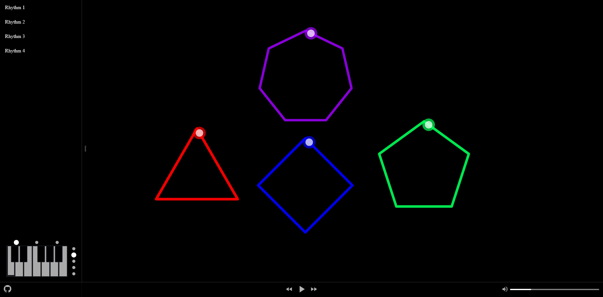

# Polyrhythm


[**Demo**](https://kecan0406.github.io/polyrhythm/)

이 프로젝트는 음(pitch)과 음정(interval)의 공감각(synesthesia)을 시각적으로 구현한 프로젝트입니다.

3 + 4, 3 + 4 + 5 조합과 같이 대조되는 리듬을 하나로 합치면 어떤 소리가 날까요?

# How to Play
- 음(pitch)
	- 왼쪽 하단 서랍에 위치해 있는 건반으로 조절합니다.
- 음정(interval)
	- 캔버스에서 마우스 휠로 조절합니다.

# Installation
```
yarn install
yarn start
```

# References and Inspiration
- [음(Pitch)과 음정(Interval)에 따른 색청(Color-Hearing)연구](http://marte.dongguk.edu/files/thesis_841973411_-28.pdf)
- [polyrhythm3 - Angramme](https://github.com/Angramme/polyrhythm3)
- [Poly Rhythms - MUSEONG](https://youtu.be/Lxs4cvSximc)
